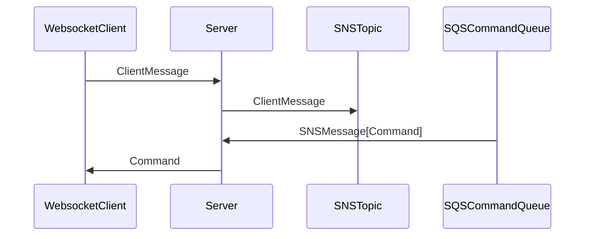

# WePositive Interview Assignment

## Docs

### Installation
* `poetry install`
* `poetry run pre-commit install`
* copy and adjust `.env.example` into `.env`

### Running tests
* `poetry run pytest`
* Running tests, linting and type checking on all files: `poetry run pre-commit run --all-files`

### Running locally
* `poetry run serve dev`
The [serve command](interview_assignment/management/serve.py) takes the following environment variables
to change how it runs with [uvicorn](https://www.uvicorn.org/settings/#http):
* FASTAPI_PORT (default 8000)
* FASTAPI_HOST (default 127.0.0.1)

### Dealing with AWS locally
You can run moto-server locally (with `docker compose up -d`) to have a fake AWS service locally. The `poetry run serve dev` command will make sure the relevant topics/queues from the settings exist on it.
There are also 2 helper commands to monitor the sns topic and publish messages to the sqs queue in the configuration.
* `poetry run monitor_sns_topic`
* `poetry run send_sqs_message '{"command": "test", "client_id": "client123"}'`

## Assignment
Depending on your prior experience, this assignment may take a lot of time. Don't spend too much time on it. We expect you to make use of AI tools effectively, since they can save you a lot of time. We also added some pointers in the existing code that may help you out. Please use them.

The goal of this FastAPI application is to serve as a bridge between websocket clients and an event driven backend that user AWS SQS/SNS to publish event messages between microservices.

The assignment is split up in 2 parts. We want to make sure we don't underestimate how much time the assignment takes, and we don't want to take too much of your time for this assignment. So you only need to focus on part 1. If we overestimated how much time part 1 takes, then you can do part 2 also as a bonus. But if you spend more than a few hours on part 1, then please don't do part 2. We would love to get your feedback on the assignment itself as well.

General pointers:
* Make sure to look at ALL the code that is already present in the repository. There is some stuff there to help you out.
* You are welcome to change/add libraries if you think they can help you out or help you to go faster, but you *can* write the code without any additional libraries. Don't loose time looking for other libraries though.
* This assignment is written for applications using AWS SQS/SNS, but if you are more familiar with MQTT, or AMQP/RabbitMQ, feel free to use those instead if that saves you time. Do realize we already added quite some helper logic/pointers to deal with SQS/SNS, but it is up to you to choose what works best for you.
* Moto-server and other helper code is included to make user testing and debugging easier, but don't feel obligated to use it if you don't need it.
* The type definitions for the messages that we receive and send have already been defined in `interview_assignment.types.aws` (see the sequence diagram below). You can use these as-is. Since often SQS messages originate from an SNS topic, we already added a type that wraps the `Command` message in an `SNSMessage` object, of which you should only forward the actual `Command` part to the websocket client.
* Although we turned on strict type checking for pyright, aioboto3 doesn't fully work with that. Its ok to `#type:ignore` those errors specifically. In general we are ok with ignoring issues with 3rd party libraries.

### Part 1
The application should do the following:
* Accept websocket connections from clients with a `client_id` argument.
* Subscribe to an SQS queue to receive `Command` messages with that `client_id` in the body, wrapped in an `SNSMessage`. Forward the `Command` to the correct websocket client based on the client_id.
* Write some tests to ensure that messages are being handled correctly. We like using pytest and pytest_mock for this (already present in the code) but if you prefer something else, feel free. We don't expect you to reach 100% code coverage now, we lowered the requirement for coverage to 80%. We just want to see you are able to write some decent tests that verify the core functionality of the application. But don't write more than a test or 2.

### Part 2 (bonus)
On top of assignment one, if you have time, we would also like to implement sending messages from the websocket client to our backend over sns. In this case it should be the ClientMessage that is sent by the websocket client. The HTML "UI" (white page with a button) that is already included in the assignment code does this.
The FastAPI application should receive that message and forward it to an SNS topic. Include the client_id in that message as an attribute that we can use later to filter on in SNS subscriptions.
The same remarks about writing tests as in part 1 apply here.
